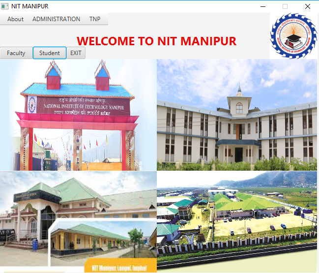
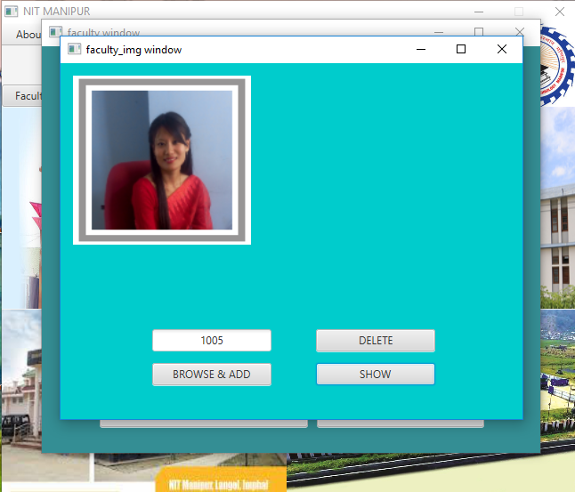
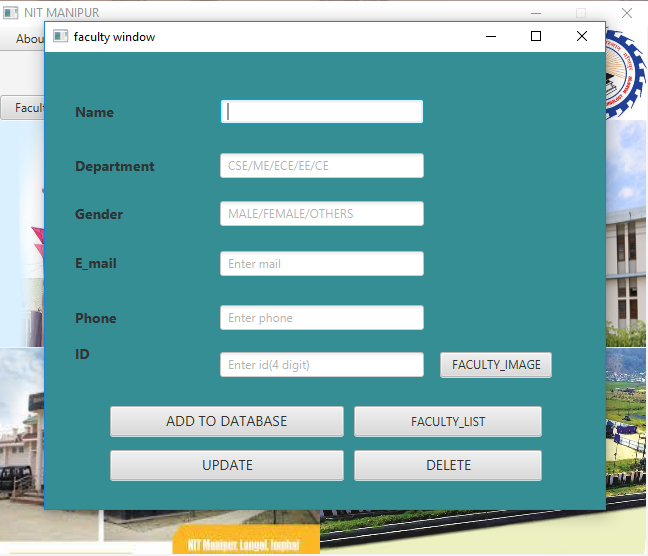
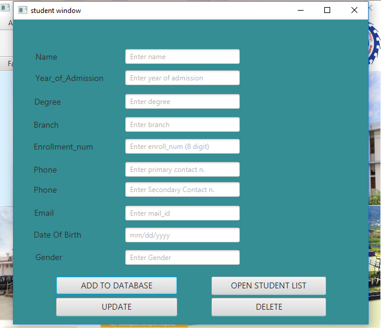
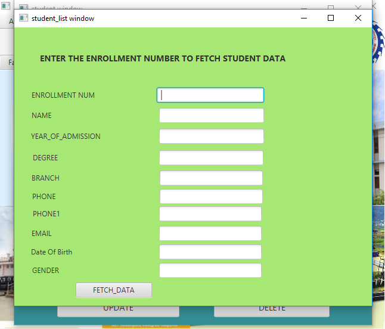

# University-database-management-system
This project contains the database of faculties and students enrolled in university/college. 
In data_base we have created three tables. First for student’s details. Second for
faculty details and third for images of each faculties.
Platform used for this project is **INTELLIJ IDEA(javafx)** and query language used is SQL.
We have created GUI in JAVAFX (**.fxml file**).
We have created a **artifacts**(executable file) for this project and location of that jar file is **DBMS_PROJECT\out\artifacts\demo2_jar**.
Following are the few snapshots of our project :-

